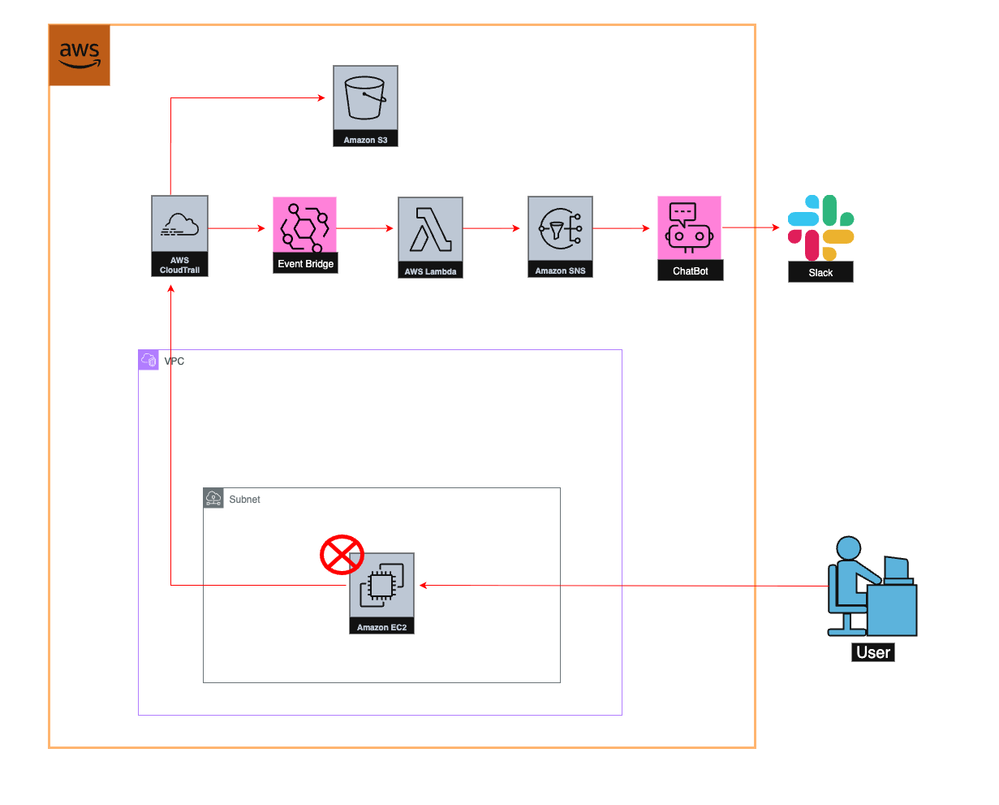
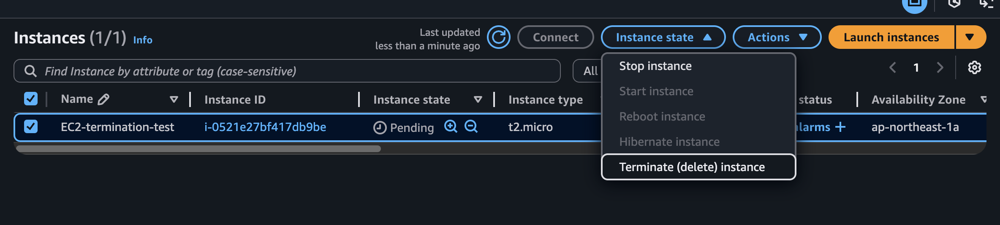

# AWS EC2 Termination Alert

## 概要
このプロジェクトは、EC2インスタンスが削除された際に検知して通知するセキュリティ特化のAWSアーキテクチャです。   
    

## アーキテクチャ
　　   

  
## 処理の流れ
1.EC2 を削除（TerminateInstances を実行）

2.CloudTrailがAPIコール（TerminateInstancesを検知（= 管理イベントを記録）

3.CloudTrailは証跡をS3に保存しつつ、同じ内容をEventBridgeにイベント(JSON)として流す

4.EventBridgeルールがこのイベントにマッチ→Lambdaを起動

5.Lambda がイベント(JSON)から 必要な項目（インスタンスID／実行者ARN／リージョン／時刻 など）を抽出・整形

6.LambdaがSNSにpublish（本文は AWS Chatbot の v1.0 構造化メッセージ）

7.SNS →（HTTPS サブスク）→ AWS Chatbot → Slack に投稿
   

  
## 実行結果（スクショ）

EC2を削除するとSlackに通知が届きます。

   
## セキュリティ配慮（マスク方針・環境変数）
✅Lambdaのコード内で使用したSNSトピックARNは、ハードコード化せず環境変数で指定。
　　Lambda > Configuration > Environment variables で設定可能

   
## 今後の拡張（IaC/GuardDuty/複数ID対応 など）
📝 IaC化（Terraform / AWS CDK）
　　手作業で構築した設定をコード化。再現性・差分管理・破棄の容易さを向上。

🔐 Security Hub / GuardDuty / AWS Config 連携
　　•GuardDuty: 侵入・不審挙動の検知を Slack に転送。
　　•Config: リソース準拠違反（例：公開 S3）の継続監視と通知。
　　•Security Hub: セキュリティ検出の集約と優先度付け。
　　
　　それぞれの Finding → EventBridge → Slack パイプラインに発展。

🕸️ 冗長性
　　今回は１つのEC2が削除された場合を想定しているので、
　　複数同時に削除された場合にも対応できるようLambdaコードを冗長化。
