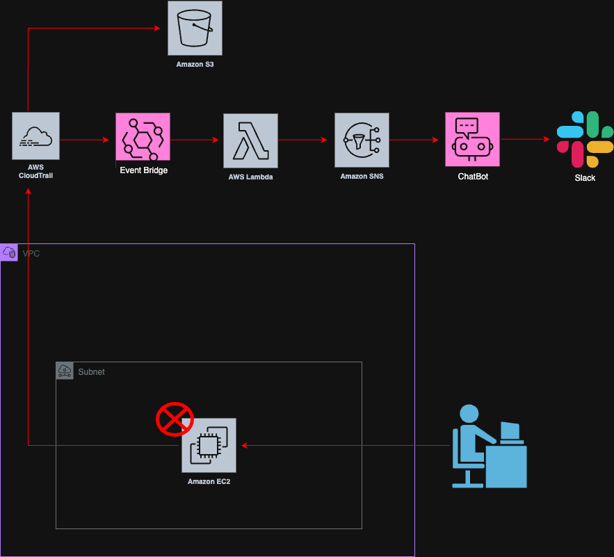

# AWS EC2 Termination Alert

## 日本語
このプロジェクトは、EC2インスタンスが削除された際に検知して通知するセキュリティ特化のAWSアーキテクチャです。

## English
This project is a security-focused AWS architecture to detect and alert when an EC2 instance is terminated.

## Architecture Diagram

